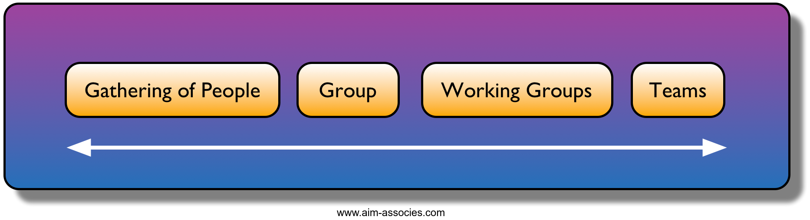

## Introduction

In this episode we will learn about teams and discuss why you should want to
work in a team in the first place. To define a team, it is useful to look at
teams in a continuum and think about the difference between a team and just any
group of people:

- Any gathering of people: they might not even know or see each other, nor
  necessarily share common interests.
- Groups: they are aware of each other and may interact, more than a
  simple gathering of people.
- Working group: a group with at least some common goals.
- Team: a group of people who act together to achieve common goals. Often,
  a group of individuals first form a working group. Then, they become a team.
  Read more about differences between working groups and teams
  [here](https://ec.europa.eu/eusa/ebooks/wit-en/book.html#chapter02).

> ## Discussion
>
> Do you work in a working group or a team?
{: .discussion}

> ## Scrum team
>
> You might have heard of a _Scrum team_ that includes people with different
roles. We will learn about it in the lesson [Introduction to
Scrum](./03-scrum-intro.md).
{: .callout}

## Why work in teams

> ## Discussion
> - What do you think are benefits of working in a team?
> - What do you think are downsides of working in a team?
>
> > ## Solution
> > ### Benefits:
> > - Boost creativity and idea generation
> > - Learn from each other
> > - Share the workload of hard complex tasks
> > - Make use of complementary strengths of employees
> > - Better decision making
> > - Increase quality of work by reviewing each other
> > - More fun! (therefore more motivated, and therefore more productive)
> > - Increase the bus factor (i.e. when someone falls under a bus, the team can take over)
> > - Project goes on even if you don't work on it.
> > - Shared ownership
> > - Have multiple perspectives on performance from different team members.
> >
> > ### Downsides:
> > - Overhead of team meetings
> > - More likely to get into conflicts with colleagues
> > - Too much peer pressure or feeling of being overlooked
> > - Not everything is under your control, so sometimes you have to work on things you do not like
> > - Teams can form isolated silos within an organisations
> > - Harder to measure contribution of individual to team outputs (think about publishing papers)
> > - You need a set of soft skills to work together successfully
> > - Leadership issues: You need some leadership, but not dictatorship
> > - Differences in number of working hours or work pace can be magnified, which can lead to frustrations
> {: .solution}
{: .challenge}

There are many benefits of working in teams, but there are clearly also some downsides.
The key is to work together in such a way that the advantages outweigh the disadvantages.
An agile way of working can help with this!

