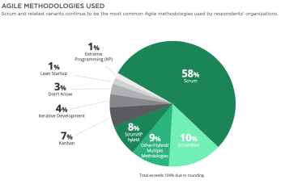

# Scrum and Kanban are both Agile methodologies
Scrum and Kanban are both Agile methodologies.
They both provide a set of practical tools that allow you to work according to the Agile manifesto and principles.

> ## Exercise: Compare Scrum and Kanban with the Agile manifesto principles
> Pick one or more principles from the [12 principles behind the Agile manifesto](http://agilemanifesto.org/principles.html)
> that we discussed in episode 2.
> **Write down how Scrum and Kanban practically implement these principles.**
> 1. Our highest priority is to satisfy the customer through early and continuous delivery of valuable software.
> 2. Welcome changing requirements, even late in development. Agile processes harness change for the customer's competitive advantage.
> 3. Deliver working software frequently, from a couple of weeks to a couple of months, with a preference to the shorter timescale.
> 4. Business people and developers must work together daily throughout the project.
> 5. Build projects around motivated individuals. Give them the environment and support they need, and trust them to get the job done.
> 6. The most efficient and effective method of conveying information to and within a development team is face-to-face conversation.
> 7. Working software is the primary measure of progress.
> 8. Agile processes promote sustainable development. The sponsors, developers, and users should be able to maintain a constant pace indefinitely.
> 9. Continuous attention to technical excellence and good design enhances agility.
> 10. Simplicity--the art of maximizing the amount of work not done--is essential.
> 11. The best architectures, requirements, and designs emerge from self-organizing teams.
> 12. At regular intervals, the team reflects on how to become more effective, then tunes and adjusts its behavior accordingly.
>
> > ## Solution
> > Example solution for principle 3: Deliver working software frequently, from a couple of weeks to a couple of months,
> > with a preference to the shorter timescale.
> > - **Kanban**: Continuous delivery (release after every finished item)
> > - **Scrum**: Release after every sprint (for example every 2 weeks)
> {: .solution}
{: .challenge}

# Differences between Scrum and Kanban
[comment]: <> (This excercise is literally copied from https://www.atlassian.com/agile/kanban/kanban-vs-scrum)
> ## Exercise: key differences between Scrum and Kanban
> See the following uncomplete table:
>
> | Aspect                        | Scrum | Kanban |
> |-------------------------------|-------|--------|
> | Release Methodology           | At the end of each sprint | Continuous delivery |
> | Cadance                       |      |       |
> | Roles                         |      |       |
> | Amount of work estimation     |      |       |
> | Change Philosophy             |      |       |
> | Meetings                      |      |       |
>
> It denotes the differences between Scrum and Kanban for 6 key aspects.
> **The first row (Release Methodology) is filled.
> Your task is to fill the last 5 rows of the table.**
> Use the following values to fill it:
>
> |    |                                                                                      |
> |----|--------------------------------------------------------------------------------------|
> | 1  | Strict roles: Product owner, scrum master & development team                         |
> | 2  | Continuous flow                                                                      |
> | 3  | Teams should not make changes during the sprint                                      |
> | 4  | No strict meetings                                                                   |
> | 5  | No required roles, perhaps a Product Owner                                           |
> | 6  | It is assumed that the amount of work is somewhat equal for different work items     |
> | 7  | Strict meetings: sprint planning, sprint review, sprint retrospective, daily standup |
> | 8  | Change can happen at any time                                                        |
> | 9  | Amount of work for a work-item is estimated in story points                          |
> | 10 | Regular fixed length sprints (1-4 weeks)                                             |
>
> > ## Solution
> >
> > | Aspect              | Scrum | Kanban |
> > |---------------------|-------|--------|
> > | Release Methodology | At the end of each sprint | Continuous delivery |
> > | Cadance             | 10: Regular fixed length sprints (1-4 weeks) | 2: Continuous flow |
> > | Roles               | 1: Strict roles: Product owner, scrum master, development team | 5: No required roles, perhaps a Product Owner |
> > | Amount of work estimation | 9: Amount of work for a work-item is estimated in story points    | 6: It is assumed that the amount of work is somewhat equal for different work items |
> > | Change Philosophy   | 3: Teams should not make changes during the sprint | 8: Change can happen at any time |
> > | Meetings            | 7: Strict meetings: sprint planning, sprint review, sprint retrospective, daily standup | 4: No strict meetings |
> >
> > NB: Adapted from https://www.atlassian.com/agile/kanban/kanban-vs-scrum
> {: .solution}
{: .challenge}

# ScrumBan and hybrid methodologies
The Scrum framework itself is really strict in adapting the full set of Scrum rules and not go "cherry picking".
In general failed Scrum implementations are said to have failed because of: "not doing it right or not doing it completely".

Nevertheless, it is common to do a mixture of Scrum and Kanban, picking the best of both worlds according to the team's needs.
This is called ScrumBan.
ScrumBan manifests itself in different ways depending on your team
characteristics. The team may use team meetings (like retrospective and
planning) from Scrum and a continuous workflow with WIP limits from Kanban.

In fact it is quite common to use 'hybrid' methodologies, picking suitable aspects from any of the different Agile methodologies.

We encourage you to iteratively shape the preferred methodology for your team, trying out different concepts from Kanban,
Scrum and other methodologies.

> ## Exercise: Ensuring team improvements
> How would you ensure that your team keeps improving their team process and Agile methodology?
>
> > ## Solution
> > Having a recurring retrospective meeting that completely focuses on the team process ensures that
> > the team will revise their working methods regularly.
> > Without such a meeting it is easy to forget about this very important topic.
> {: .solution}
{: .challenge}

# Other Agile methodologies
See this  figure from the [2020 state of Agile survey](https://stateofagile.com/#ufh-i-615706098-14th-annual-state-of-agile-report/7027494).
It depicts the popularity of used Agile methodologies.

So far we have only discussed Scrum and Kanban, since they are the most popular Agile methodologies.

Nevertheless, there are many other methodologies that go beyond the scope of this course but are worth exploring, to name a few:
* Extreme Programming (see [extremeprogramming.org](http://www.extremeprogramming.org/))
* Lean Startup (see [this summary video](https://www.youtube.com/watch?v=RSaIOCHbuYw))
* Spotify Model (see [this summary video](https://www.youtube.com/watch?v=4GK1NDTWbkY))
* Dynamic Systems Development Method (DSDM, see [this summary video](https://www.youtube.com/watch?v=RSaIOCHbuYw))


